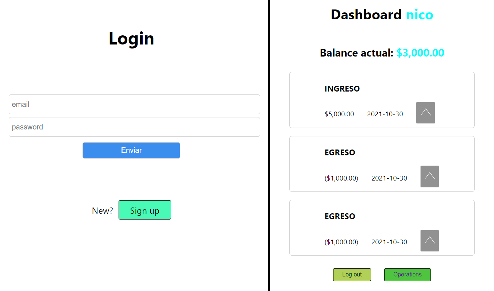

# **Alkemy FullStack app challenge**
## [You can see this project live here](https://indevelopment.com)

 

### **Project local run instructions**
* Check package.json for commands about the project
* You must put in a *.env* file db info and copy paste in your database the *schema.sql* queries

 

* Execute *npm install* in the root folder and in the client folder

**OR**

* You can run the project locally with *npm run devstart* that make the work for you

 

# **Overview**
