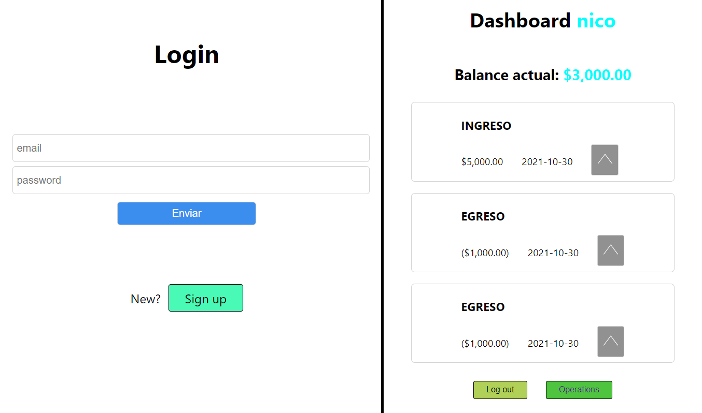

# **Alkemy FullStack app challenge**
## [You can see this project live here](https://alkemy-fullstack-challenge.herokuapp.com/)

 

## **Project local run instructions**
* Check package.json for commands about the project
* You must put in a *.env* file db info and copy paste in your database the *schema.sql* queries

 

* Execute *npm install* in the root folder and in the client folder

**OR**

* You can run the project locally with *npm run devstart* that makes the work for you

 

## **Overview**

* On live version you can access an account for testing fast the app and his credentials are:

                * email: probe@gmail.com
	            * password: probe

## **Features/Project requeriments**
* Login and Register: page for attach operations with the user
* Home or dashboard: initial page where you can see your last ten (10) transactions and total balance
* Transactions or operations: page where you can see all operations but filtered between "income's" and "expense's", and if is a expense you can filter between categories too. You can add operations. And you can access to a edit mode where you can edit or delete an operation.

## **Build with**
* React for front-end
* Node for back-end
* Json Web Token (JWT) for login and register
* JavaScript
* CSS3 & HTML5